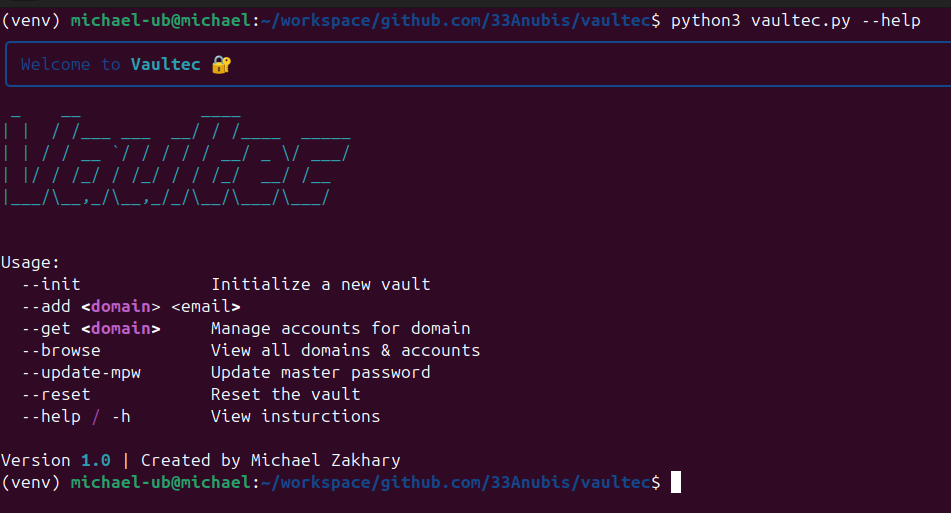
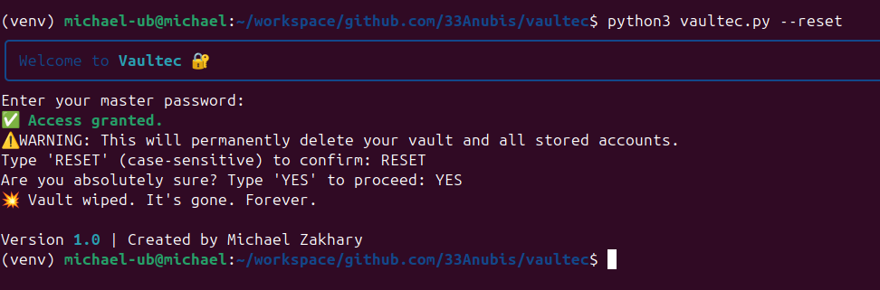
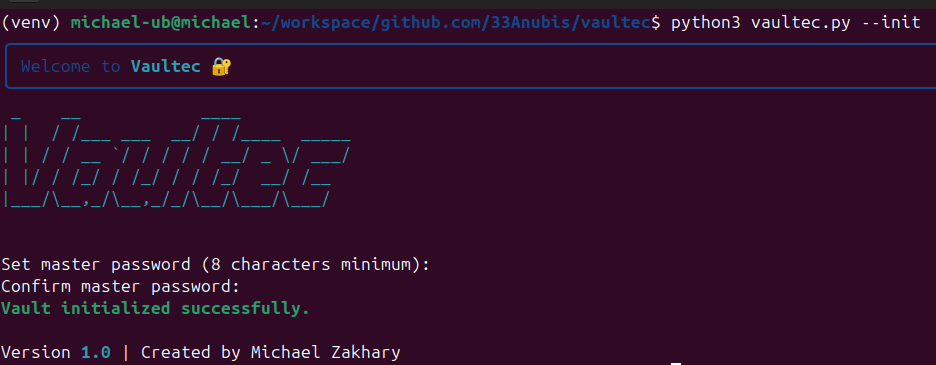
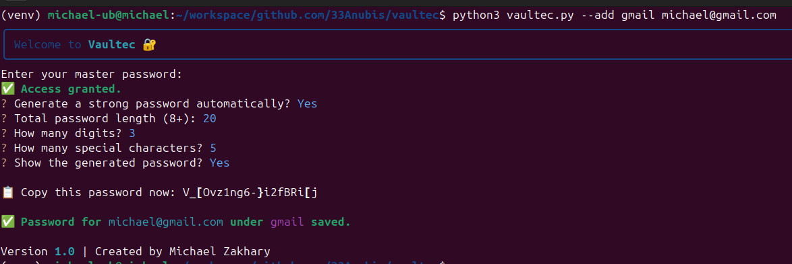
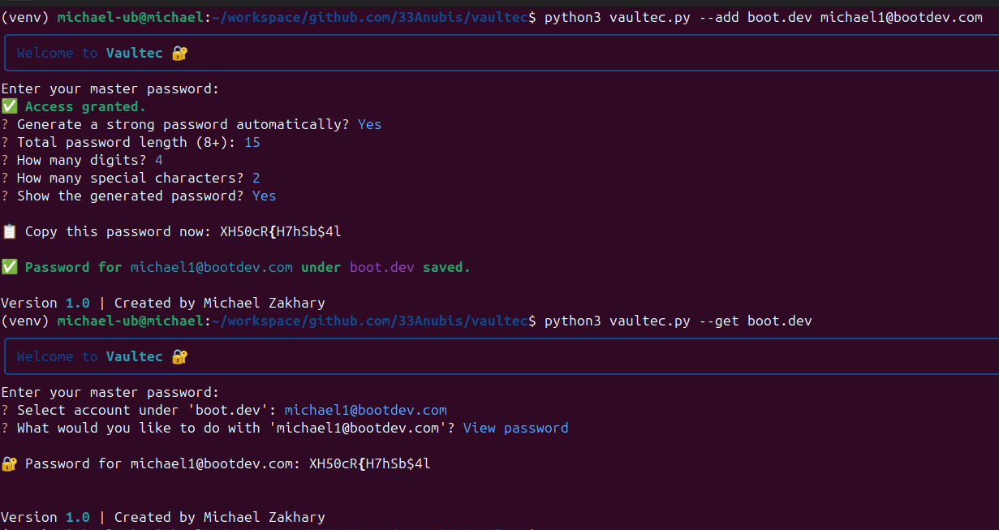
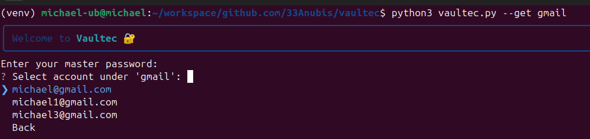
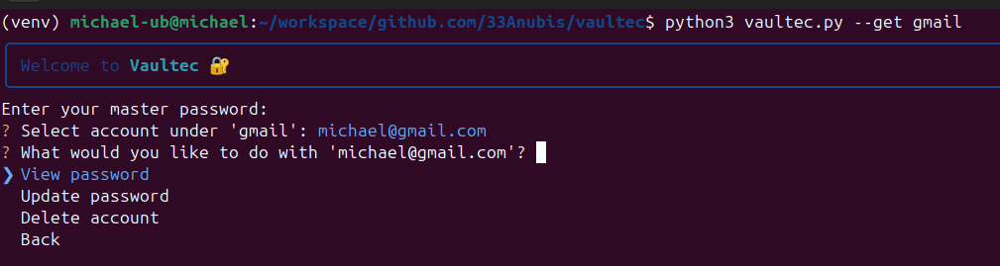
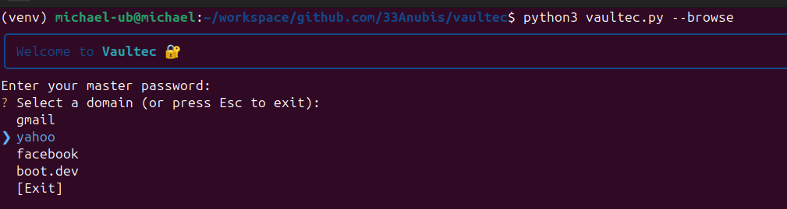
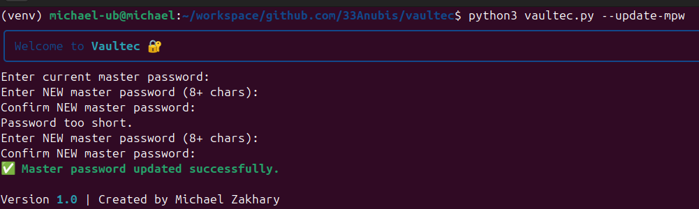

# 🔐 Vaultec

**Vaultec** is a lightweight, offline command-line password manager built with Python.

It uses strong encryption to safely store multiple account credentials per domain, all protected by a master password you control.

No cloud. No telemetry. Just secure local storage, with a clean CLI UI.

# Features (v1.0)

- Master password with salted hashing
- Update your master password (automatically re-encrypts the vault)
- AES-based vault encryption (via Fernet)
- Store multiple accounts per domain
- Interactive CLI with arrow-key navigation (InquirerPy)
- Random password generator with custom rules:
  - Total length
  - Number of digits
  - Number of special characters
- Update or delete credentials for any saved account
- Browse entire vault or view accounts by domain
- Styled output with Rich + ASCII banner via PyFiglet

> ⚠️ Still in development – use at your own risk. Not intended for production or sensitive info (yet).

# Quick Setup

```bash
python3 -m venv venv
source venv/bin/activate
pip install -r requirements.txt
python vaultec.py --init
```

# Commands

```python
python3 vaultec.py --init                   # Initialize a new vault
python3 vaultec.py --add <domain> <email>   # Add a new account
python3 vaultec.py --get <domain>           # View/update/delete an account under a domain
python3 vaultec.py --browse                 # Browse all domains + accounts
python3 vaultec.py --update-mpw             # Update your master password
python3 vaultec.py --reset                  # Wipe vault and start fresh
```

# What I Learned

## Encryption

Before this project, "encryption" was a black box to me. Now, I understand it as a two-step process:

### Password Hashing

- The master password (MPW) is hashed using a salted hash (PBKDF2-HMAC-SHA256) so that even if someone gets the vault file, they can't brute-force the actual password easily.

- The salt (adding random characters) ensures that two users with the same password won’t generate the same hash.

### Fernet Key Derivation

- From the master password + salt, I derive a Fernet key that encrypts/decrypts all account passwords.

- If you change your master password, I decrypt every saved password using the old key, then re-encrypt them with a new key. Since, you know, the Fernet key is derived from the MPW.

- That was tricky to wrap my head around, but it gave me a much deeper appreciation for what secure apps actually do under the hood.

This was my first real dive into crypto, and I now feel comfortable building basic secure tools from scratch.

### Hashing (One-Way)

Hashing is irreversible, you cannot get the original input back from a hash.

- It’s typically used for verification, not storage.

- Example use: storing password hashes in a database.
- When a user logs in, their password is hashed using the same algorithm and salt, and if it matches the stored hash, they're authenticated.

- A cryptographic hash function like SHA-256 or bcrypt always produces the same output for the same input, but with salting and key stretching (like PBKDF2), you make brute-force attacks much harder.

### Encryption (Two-Way)

Encryption is reversible, if you have the key, you can decrypt the ciphertext and recover the original data.

- It's used for secure storage and transport of data you eventually want to read again.

- In Vaultec, you encrypt each account's password using a symmetric key (Fernet key) derived from the master password.

- If someone gets the encrypted data without the key, it’s unreadable. But if they get the key? Game over, which is why you store only a hashed version of the master password, not the key itself.

## Modularity

This was a crash course in why code structure matters.

I noticed that logic for things like password validation, encryption, or user prompts ended up copy-pasted in multiple places. With more time, I would refactor those into shared utilities, for example:

- A validate_password() function

- A generate_password() wrapper

Still, this taught me how to identify repeated logic and where abstraction starts to matter to organize code and make reusing it faster and easier and more consistent.

## Future Improvements

1. Refactor repetitive logic: like input validation and encryption steps : into shared utility functions.

2. Polish CLI styling: consistent use of rich and color choices that are readable but not overwhelming.

3. Stateful CLI session: avoid asking the user for the master password repeatedly by storing an in-memory key for the duration of a session.

4. Fuzzy search: type part of a domain name or username and instantly filter results.

5. Frontend GUI: after learning React or Electron, build a companion desktop app.

6. Import/export vault: backup vaults or sync across machines.

7. Unit tests and CI: to ensure security and regression protection.

8. Browser extension: future plan to autofill passwords directly in the browser.

# Special thanks to Boot.dev for organizing the hackathon and giving me this chance to participate.

# Screenshots

#### Help

#### Reset

#### Intializing a vault

#### Adding an account

#### Adding + Retrieving a pw

#### Get by domain name

#### Get by domain name - options

#### Browsing

#### Updating Master Password

